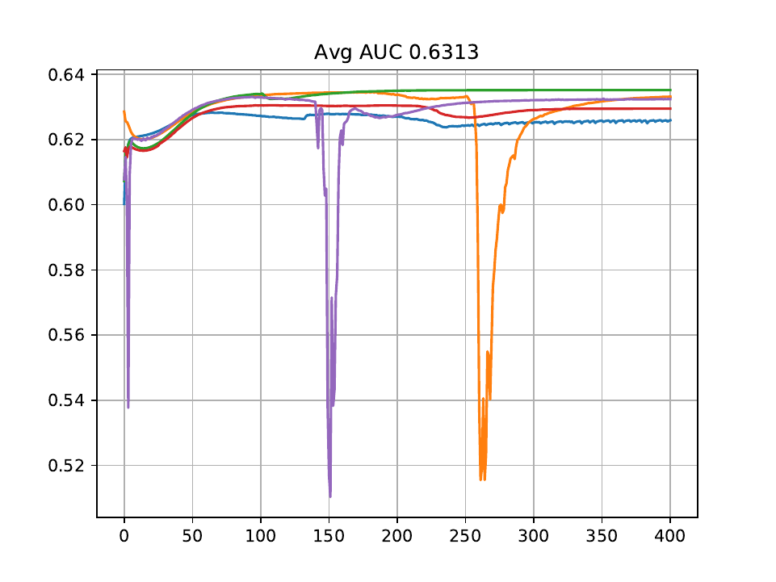

# Deep Generative Models for Reject Inference in Credit Scoring 
Code for the framework in **Deep Generative Models for Reject Inference in Credit Scoring** ([paper](https://arxiv.org/abs/1904.11376)).

If you use this code in your research, please cite:

	@article{mancisidor2020deep,
  		title={Deep generative models for reject inference in credit scoring},
		author={Mancisidor, Rogelio A and Kampffmeyer, Michael and Aas, Kjersti and Jenssen, Robert},
		journal={Knowledge-Based Systems},
		volume={196},
		pages={105758},
		year={2020},
		publisher={Elsevier}
	}

## Requirements
The code for model1 and model2 in the paper are developed in Theano. We suggest to run the code using `Docker`. Run the command `docker pull rogelioandrade/theano_setup:v4` to pull an image with all dependencies into your local machine or to run the code in a cluster, e.g. using `AKS`.

The structure of the project should look like this:

```
reject_inference
               │───data
               │───output
               │───python
                   │───model1
                   │───model2
```
Otherwise you will get error messages when loading the data, saving figures etc.

**Note**: you can run `bash build_image` to build the above image and mount all folders inside `reject_inference`.

## Downloads
### Lending Club Dataset

Inside `data` there are two zip files containing the supervised (`supervised_lc_paper.pk.gz`) and unsupervised (`unsupervised_lc_paper.pk.gz`) data sets for Lending Club. 

### Pretrained models 
Pretrained models are available in the `output` folder. To load a pretrained model use the script `test_model1.py` or `test_model2.py`. 

**Note**: Weights trained on a GPU(CPU) can only be loaded again on a GPU(CPU). The pretrained weights in the `output` folder were trained on a GPU.

## Usage
### Training

Make sure the [requirements](#requirements) are satisfied in your environment, and relevant [datasets](#downloads) are downloaded. `cd` into `python/model1` or `python/model2`, and run

For model1 (on GPU)
```bash
THEANO_FLAGS=device=cuda0,floatX=float32 python -u training_model1.py --outfile model1 --epochs 401 --n_cv 1 --beta 1.1 --dset paper --n_sup 1552 --n_unsup 30997 
```

For model2 (on GPU)
```bash
THEANO_FLAGS=device=cuda0,floatX=float32 python -u training_model2.py --outfile model2 --epochs 501 --n_cv 1 --beta 1.1 --dset paper --n_sup 1552 --n_unsup 30997 
```

To run the code on cpu replace `device=cuda0` for `device=cpu`.

You can play with the hyperparameters using arguments, e.g.:
- **`--n_sup`**: number of observations from the minority class, i.e. y=1
- **`--n_unsup`** number of unsupervised  observations
- **`--zdim`**: dimension of latent variable

For all arguments see all `add_argument()` functions in `training_model1.py` and `training_model2.py`

#### Stability
<p align='center'></p>
As mentioned in the paper, training M1 and M2 can be unstable. For example, the above diagram shows the test AUC during model training. In two of the runs, model training became unstable and it is reflected by a sharp and sundden drop in AUC.

### Analyzing
<p align='center'></p>

Run `model.plot_gmm_space()` to draw `z` representations and visualize them as 2D t-sne vectors. The above figure shows a mixture of two Gaussians distributions in the latent space. The representations for customers with class label y=1 lie in the upper-right cuadrant. The histograms on the side show the estimated default probability for each class label. Customers with class label y=1 have on average higher default probabilities. The scatter color is given by its estimated default probability.      

**Note**: It takes some epochs (~500 epochs) before the latent space shows a mixture model.
